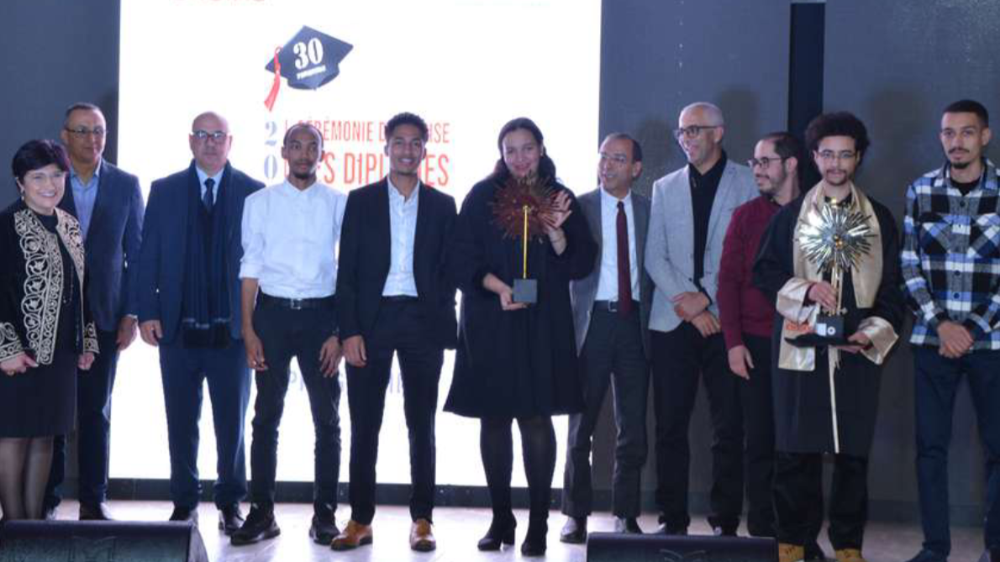
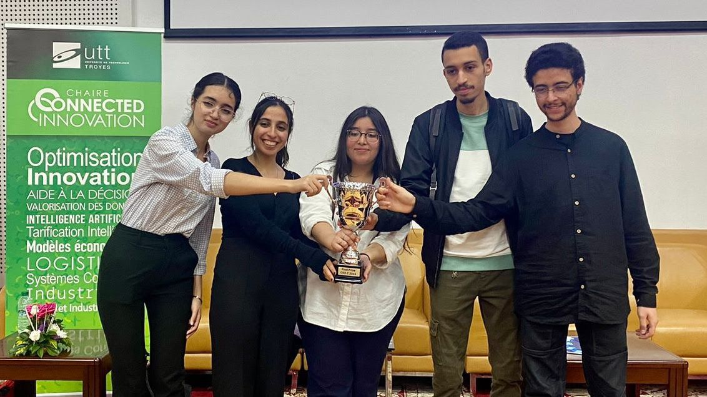
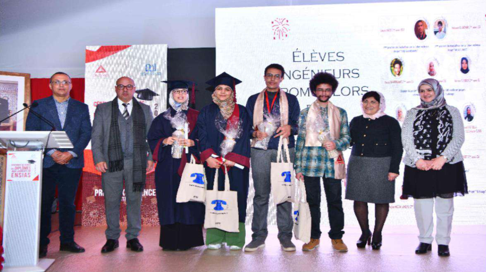
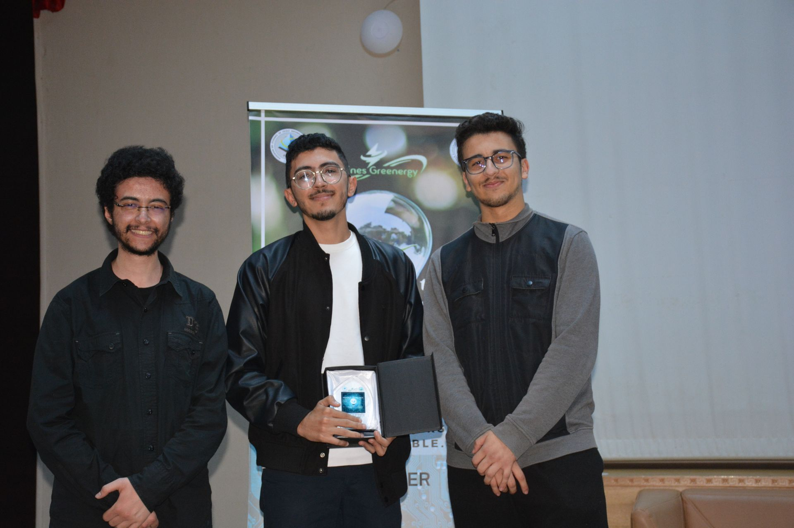
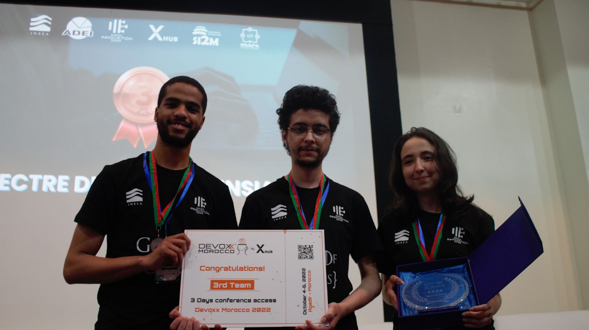

A chronicle of recognition for my contributions to innovation, research, and competitive problem solving.

## 2024

### Tribute @ the ENSIAS Graduation Ceremony for Scientific Excellence
I was honored by my engineering school for my achievements in multiple scientific events, mainly the NASA Space Apps Challenge 2024, the CITX.0, and the MDFDS 2024.

### 1st Rank & Global Nominee @ the NASA Space Apps Challenge
Secured the 1st place in the NASA Space Apps Challenge—Ifrane Section and qualified for the international judging level for the development of a digital solution to support farmers in their decision-making and optimize water usage with AI and NASA's open data.

### 1st Prize @ the Connected Innovation and Technology X.0 Contest
This exceptional event was organized by the UTT Foundation (France) and held simultaneously in Morocco at ENSAM Rabat, in France at Hôpital Européen Marseille, and in Vietnam at the Da Nang University of Science and Technology. Our project, SparkBuild, garnered attention for its innovative use of artificial intelligence to predict and optimize the energy consumption of buildings, setting a new standard for sustainable development.

### 1st Prize @ the Moroccan Days For Data Science Hackathon (MDFDS)
We were honored to win the 1st prize in the 1st edition of the Moroccan Days For Data Science (MDFDS) organized by CODE-ESI, with our project idea "Pharma Wizard," an AI-based solution that handles the problem of supply chain shortages in pharmaceutical products, as one of the current and sensitive problems in Morocco.



### Tribute @ the Rabat Science Festival (FSR)
The second edition of the Rabat Science Festival, an event aimed at promoting scientific knowledge, encouraging innovation, and providing a platform for science enthusiasts, opened on Thursday, February 15, 2024, at the National Library of the Kingdom of Morocco (BNRM). I was honored for my success in the NASA Space Apps Challenge.

## 2023

### Tribute @ the ENSIAS Graduation Ceremony for Scientific Excellence
I was honored by my engineering school for my achievement in the NASA Space Apps Challenge 2023.

### 3rd Rank & Global Nominee @ NASA Spaces Apps Challenge
Won the 3rd prize in the NASA Space Apps Challenge - Rabat Section and qualified to the international judging level for the development of a distributed framework of exoplanets detection based on self-supervised machine learning.

> They talked about it: [ENSIAS Official Post](https://www.facebook.com/share/p/1MMWv1rf6a/).

### 1st Rank @ the Mines Greenergy Competition
Got the first place among the participants in a competition organized by Greenergy Club in ENIM School about the applications of AI in the energy sector with a project of reinforcement learning and smart microgrid management.

## 2022

### Bronze Medal @ Game of Codes INSEA CP contest
I managed with my team to secure the 3rd place in the 1st edition of the GOC Competitive Programming Contest organized by the INSEA Innovation Edge Club.

## 2019

### Scholarship ISTIHQAQ 2019
In 2019, I was honored to receive the [Istihqaq scholarship](https://www.fm6education.ma/wp-content/uploads/2019/11/Rabat-Salé-Kenitra-.pdf), a prestigious merit-based award from the Fondation Mohammed VI de Promotion des Œuvres Sociales de l'Éducation-Formation, aimed at supporting top Moroccan high school graduates, particularly children of education personnel. This scholarship, requiring a "Très Bien" baccalaureate mention and a minimum weighted score of 16/20, provides 30,000 DH over three years to pursue higher education in public or state-recognized private institutions in Morocco.

